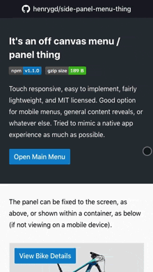

# Side Panel / Mobile Menu Thing [![npm][npm-image]][npm-url] [![File Size][size-image]][cdn-url]

[npm-image]: https://badgen.net/npm/v/side-panel-menu-thing
[npm-url]: https://www.npmjs.com/package/side-panel-menu-thing
[size-image]: https://badgen.net/badgesize/gzip/henrygd/side-panel-menu-thing/master/dist/side-panel-menu-thing.min.js
[cdn-url]: https://cdn.jsdelivr.net/npm/side-panel-menu-thing/dist/side-panel-menu-thing.min.js



https://henrygd.me/side-panel-menu-thing

Touch responsive, easy to implement, fairly lightweight, and MIT licensed. Good option for mobile menus, general content reveals, or whatever else. Tried to mimic a native app menu as much as possible.

- **ES Module**: `dist/side-panel-menu-thing.mjs`
- **UMD**: `dist/side-panel-menu-thing.umd.js`
- **IIFE / CDN**: `dist/side-panel-menu-thing.min.js`
- **Svelte**: `src/side-panel-menu-thing.svelte`

## Install

```
$ npm install side-panel-menu-thing
```

Grab the few lines of CSS from [`dist/side-panel-menu-thing.css`](dist/side-panel-menu-thing.css) and add to your styles.

## Usage and options

```js
import sidePanel from 'side-panel-menu-thing'

// target and content required, others optional
const menu = sidePanel({
	// target container (where it's mounted and listens for touch)
	target: document.body,
	// panel content (will be removed and added in the panel)
	content: document.getElementById('content'),
	// width of panel
	width: 400,
	// open / close animation time
	duration: 450,
	// fixed to screen
	fixed: true,
	// open on left
	left: false,
	// whether to open on touch drag
	dragOpen: true,
	// runs when the menu is opened (as soon as it's visible)
	onShow: () => console.log('showing'),
	// runs when the menu is closed (as soon as it's hidden)
	onHide: () => console.log('hidden'),
})

// options are accessible / changeable afterward
menu.width
// 400
menu.width = 500
// 500
```

## Methods

```js
// show the panel
menu.show()

// hide the panel
menu.hide()

// destroy
menu.$destroy()
```

## Disable drag opening on certain elements

If you have a fixed menu set to open on drag, but want disable on a specific element, add a `data-no-panel` attribute to the html.

```html
<div class="slider" data-no-panel>
	<div class="slide"></div>
	<div class="slide"></div>
</div>
```

## Do I need to use Svelte?

No. This was built using Svelte but doesn't require it to use.

If you _are_ using it already in your project, you can import the svelte component rather than the processed bundle. If you're using rollup or webpack, this should happen automatically. Then pass the options in as props, including target, as below.

I will probably release this as a standalone component at some point with a proper slot.

```js
const menu = new sidePanel({
	target: document.body,
	props: {
		target: document.body,
		content: document.getElementById('menu'),
	},
})
```

## Internet Explorer Support

To use with IE, you need some polyfills. Easiest solution is to insert the script below in your html above where you're loading your other scripts. This will load the polyfills only in unsupported browsers.

```html
<script>
	if (!('customElements' in window)) {
		window.requestAnimationFrame = window.requestAnimationFrame.bind(window)
		window.setTimeout = window.setTimeout.bind(window)
		document.write(
			'<script src="https://cdn.jsdelivr.net/combine/npm/promise-polyfill@8.1.0/dist/polyfill.min.js,npm/classlist-polyfill@1.2.0/src/index.js,npm/mdn-polyfills@5.19.0/Array.prototype.fill.js,npm/@webcomponents/webcomponentsjs@2.4.1/webcomponents-bundle.min.js"><\/script>'
		)
	}
</script>
```

## License

MIT
